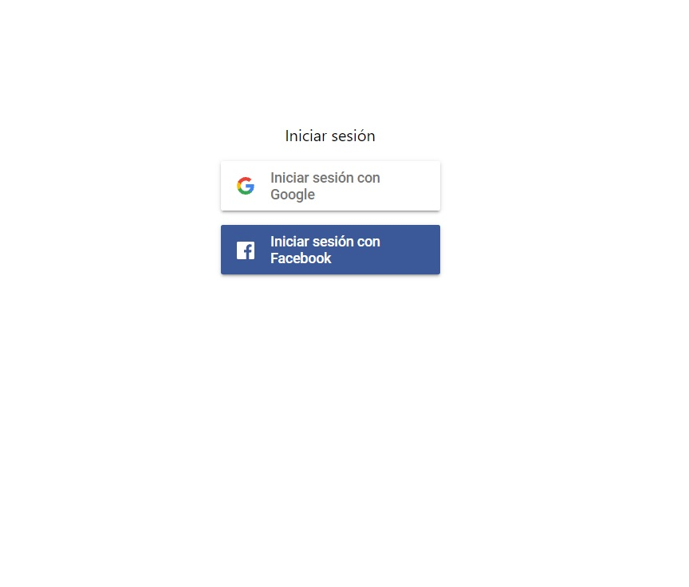
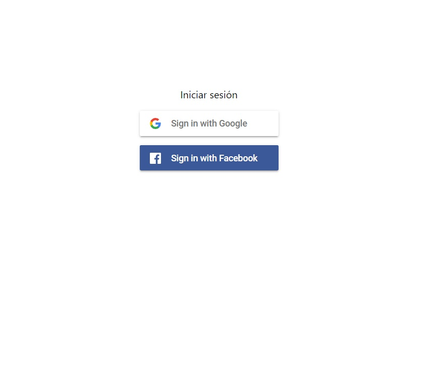
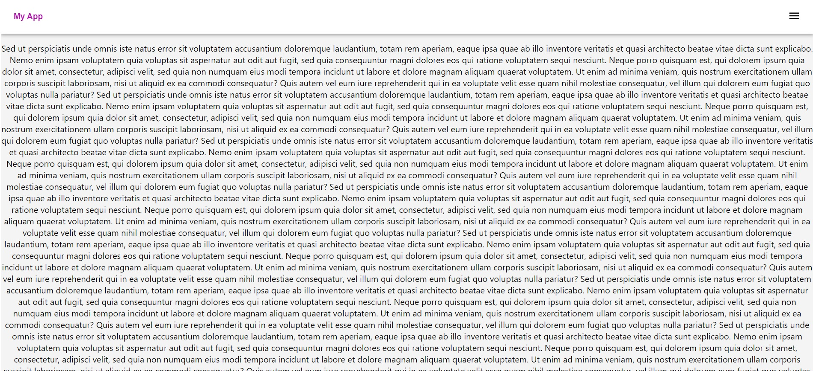
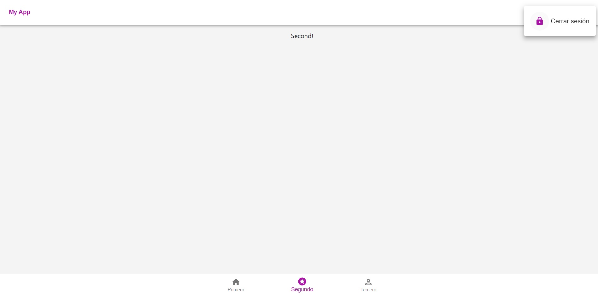

# React-firebase-auth-template

Easy authentication. You only need your firebase project credentials to run this template
You can choose multiple languages for login( If you need to change firebaseui language, please review your language code https://github.com/firebase/firebaseui-web/blob/master/LANGUAGES.md )

English firebaseUi (default):

Navigate through pages by bottom-nav

## Libraries Used

* firebase
* react-firebaseui
* react router
* react router dom
* material-ui
* react-firebaseui-localized (to change firebaseui language easily)

## How to use

* npm install in root directory
* npm run start